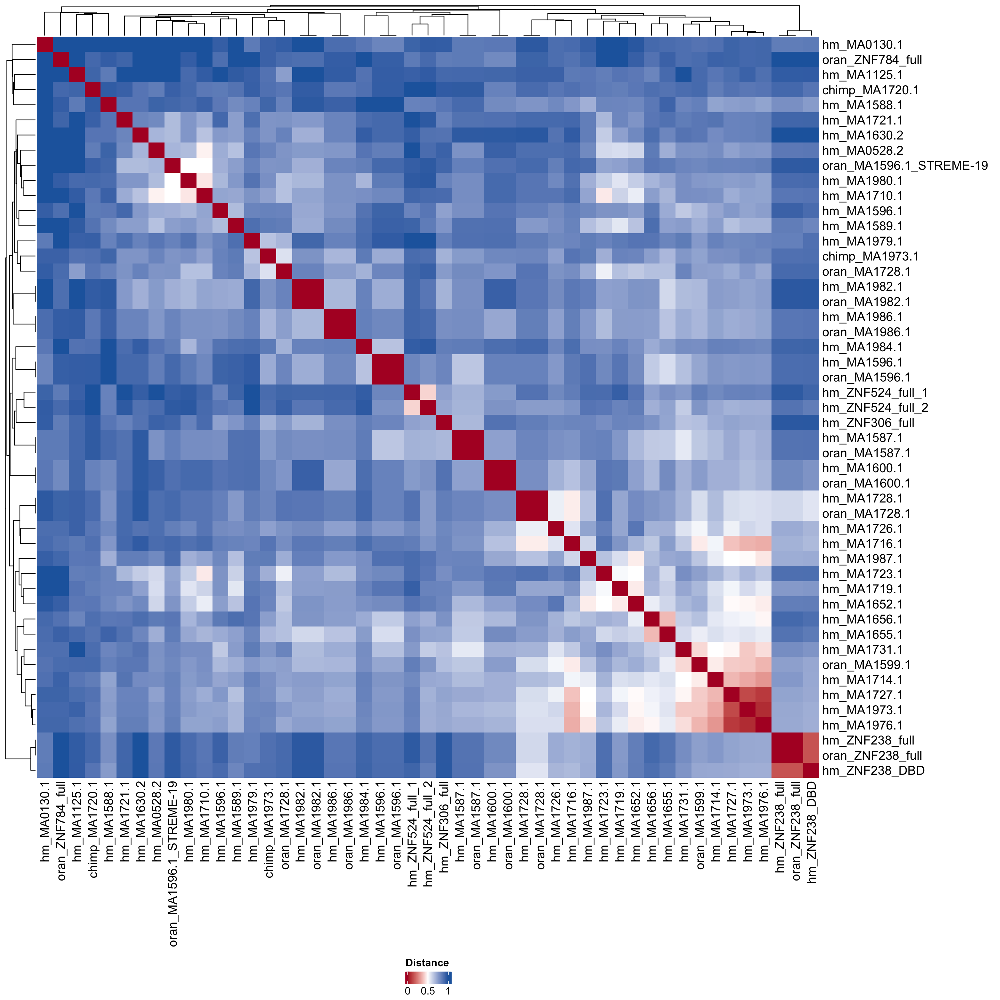

# Motif consensus heatmap

Motif Consensus Clustering (IUPAC-aware, 3-mer Jaccard distance)

-   read table

-   get consensus sequence

-   flat symbols

-   calculate 3-mer set

-   calculate jaccard distance matrix between motifs

-   use hierarchical clustering to visualize data

```{r}
library(dplyr)
library(tidyverse)
library(ComplexHeatmap)
library(circlize)
```

```{r}
iupac_dict <- list(
  A = c("A"), C = c("C"), G = c("G"), T = c("T"),
  R = c("A", "G"), Y = c("C", "T"), S = c("G", "C"), W = c("A", "T"),
  K = c("G", "T"), M = c("A", "C"), B = c("C", "G", "T"),
  D = c("A", "G", "T"), H = c("A", "C", "T"), V = c("A", "C", "G"),
  N = c("A", "C", "G", "T")
)

expand_iupac <- function(seq) {
  chars <- strsplit(seq, "")[[1]]
  expanded <- lapply(chars, function(x) iupac_dict[[x]])
  expand.grid(expanded, stringsAsFactors = FALSE) %>%
    apply(1, paste0, collapse = "")
}

get_kmers <- function(seq, k = 3) {
  all_seqs <- expand_iupac(seq)
  kmers <- unlist(lapply(all_seqs, function(s) {
    n <- nchar(s)
    if (n < k) return(character(0))
    sapply(1:(n-k+1), function(i) substr(s, i, i+k-1))
  }))
  unique(kmers)
}

jaccard_dist <- function(motifs) {
  kmerset <- lapply(motifs, get_kmers)
  n <- length(kmerset)
  distmat <- matrix(0, n, n, dimnames=list(names(motifs), names(motifs)))

  for (i in 1:n) {
    for (j in 1:n) {
      inter <- length(intersect(kmerset[[i]], kmerset[[j]]))
      union <- length(union(kmerset[[i]], kmerset[[j]]))
      distmat[i, j] <- 1 - inter/union
    }
  }
  distmat
}
```

```{r}
df <- read.csv("../../../tables/znfs_motifs.csv")
df <- df %>%
  mutate(new_species = case_when(
    species == "human" ~ "hm",
    species == "chimp" ~ "chimp",
    species == "orangutan" ~ "oran",
    TRUE ~ NA_character_   # 其他情況
  ))

# fill data
df[2,3] <- "MA1125.1"
df[4,3] <- "MA1596.1"
df[37,3] <- "MA1973.1"
df[38,3] <- "MA1720.1"
df[39,3] <- "MA1728.1"
df[45,3] <- "MA1596.1_STREME-19"
df[45,5] <- "AGGCTGAGGCRG"

    
df_h <- df %>% filter(species=="human")
df_c <- df %>% filter(species=="chimp")
df_o <- df %>% filter(species=="orangutan")
```

```{r}
# Combine (or you can cluster individually)
df <- bind_rows(df_h, df_c, df_o)

# Use ALT_ID as name if available, otherwise MOTIF_ID
motif_names <- df$MOTIF_ID

motifs <- df$CONSENSUS
names(motifs) <- paste(df$new_species, motif_names, sep="_")

# -----------------------
# Compute distance matrix
# -----------------------
dist_mat <- jaccard_dist(motifs)

# -----------------------
# Heatmap with dendrogram
# -----------------------

col_fun = colorRamp2(
  c(0, 0.5, 1),
  c("#b2182b", "white", "#2166ac")
)

Heatmap(
  dist_mat,
  col = col_fun,
  name = "Jaccard distance",
  show_row_names = TRUE,
  show_column_names = TRUE,
  clustering_distance_rows = "euclidean",
  clustering_distance_columns = "euclidean",
  clustering_method_rows = "average",
  clustering_method_columns = "average",
  heatmap_legend_param = list(
    title = "Distance",
    legend_direction = "horizontal"
  )
)
```

```{r}
png("heatmap_output.png", width = 4000, height = 4000, res = 300)
ht <- Heatmap(
  dist_mat,
  col = col_fun,
  name = "Jaccard distance",
  show_row_names = TRUE,
  show_column_names = TRUE,
  clustering_distance_rows = "euclidean",
  clustering_distance_columns = "euclidean",
  clustering_method_rows = "average",
  clustering_method_columns = "average",
  heatmap_legend_param = list(
    title = "Distance",
    legend_direction = "horizontal"
  )
)

draw(ht, heatmap_legend_side="bottom")
dev.off()
```


